<!--
  ╔══════════════════════════════════════════════════════════════════╗
  ║  Krish Maheshwari · GitHub profile README                         ║
  ║  CS student · Full-stack developer · ML & data science            ║
  ║                                                                    ║
  ║  Built like a product, not a template. Hand-authored animated     ║
  ║  SVGs live in /assets — edit those, not third-party widgets.      ║
  ║  Customisation guide → docs/CUSTOMIZATION.md                      ║
  ║  Design tokens        → docs/DESIGN.md                            ║
  ╚══════════════════════════════════════════════════════════════════╝
-->

<!-- ░░░░░░░░░░░░░░░░░░░░░░░░  HERO  ░░░░░░░░░░░░░░░░░░░░░░░░ -->

  

    

  <!-- dynamic typed subtitle (replaceable third-party widget — see docs/CUSTOMIZATION.md) -->
  

   

  <!-- ── primary links ─────────────────────────────────────── -->
  
  
  
  
  
  

    

  <!-- ── section nav (links resolve to GitHub's auto heading anchors) ── -->
  <kbd><a href="#about">About</a></kbd> &nbsp;
  <kbd><a href="#tech-stack">Tech Stack</a></kbd> &nbsp;
  <kbd><a href="#core-cs">Core CS</a></kbd> &nbsp;
  <kbd><a href="#projects">Projects</a></kbd> &nbsp;
  <kbd><a href="#experience">Experience</a></kbd> &nbsp;
  <kbd><a href="#achievements">Achievements</a></kbd> &nbsp;
  <kbd><a href="#education">Education</a></kbd> &nbsp;
  <kbd><a href="#github-stats">Stats</a></kbd> &nbsp;
  <kbd><a href="#connect">Connect</a></kbd>

   

  

 

<!-- ░░░░░░░░░░░░░░░░░░░░░░░░  ABOUT  ░░░░░░░░░░░░░░░░░░░░░░░░ -->
## About

> **I build at the intersection of full-stack development, machine learning, and real-world problems.**

I'm a **B.Tech Computer Science & Engineering (Core)** student and a **full-stack developer** with a solid foundation in programming, data structures and software development. I build **end-to-end web and app experiences**, while my deeper interests lie in **Machine Learning and Data Science**.

Driven by curiosity and a commitment to growth, I continuously expand my knowledge, master emerging technologies, and apply my skills to solve **real-world problems** with innovation and precision.

- 🎓 &nbsp;**B.Tech CSE (Core)** — Manipal University Jaipur · `2023 – 2027`
- 💻 &nbsp;Full-stack **web & app development**, end to end
- 🤖 &nbsp;Deep interest in **Machine Learning & Data Science**
- 🧩 &nbsp;Driven to solve **real-world problems** with clean, reliable software
- 💼 &nbsp;Open to **internships & opportunities**

  

<!-- ░░░░░░░░░░░░░░░░░░░░░░░░  HIGHLIGHTS  ░░░░░░░░░░░░░░░░░░░░░░░░ -->
### Highlights

  

<!-- ░░░░░░░░░░░░░░░░░░░░░░░░  TECH STACK  ░░░░░░░░░░░░░░░░░░░░░░░░ -->
## Tech Stack

**Languages**

**Frontend & Backend**

**Databases**

**Cloud, DevOps & Data**

<!-- ░░░░░░░░░░░░░░░░░░░░░░░░  CORE CS  ░░░░░░░░░░░░░░░░░░░░░░░░ -->
## Core CS

<!-- ░░░░░░░░░░░░░░░░░░░░░░░░  PROJECTS  ░░░░░░░░░░░░░░░░░░░░░░░░ -->
## Projects

<table>
<tr>
<td width="50%" valign="top">

### 🛡️ CredVeda
AI-powered **credit-risk assessment** platform that uses machine learning and predictive modeling
to evaluate creditworthiness — helping lenders make faster, more reliable decisions.

[**→ View repo**](https://github.com/KrishMaheshwari-pro/CREDVEDA)

</td>
<td width="50%" valign="top">

### ⛓️ AidChain
**Blockchain donation platform** that releases disaster-relief funds step-by-step through smart
contracts. Donors verify each milestone with real proofs and track every ETH transaction.

[**→ View repo**](https://github.com/KrishMaheshwari-pro/AIDCHAIN)

</td>
</tr>
<tr>
<td valign="top">

### 🤝 LendConnect
Full-stack **micro-lending platform** connecting borrowers and lenders directly — built for rural
and semi-urban households to avoid high-interest debt traps from banks and moneylenders.

[**→ View repo**](https://github.com/KrishMaheshwari-pro/LendConnect)

</td>
<td valign="top">

### 🎮 STEM-QUEST
**Gamified learning platform** for rural schools (grades 6–12) — interactive games, multilingual
content and offline access to engage students with limited internet connectivity.

[**→ View repo**](https://github.com/KrishMaheshwari-pro/STEM-QUEST---Gamified-learning-Platform-for-rural-education)

</td>
</tr>
</table>

<b>＋ View more projects</b>

 

- **[RAG Chatbot](https://github.com/KrishMaheshwari-pro/RAG-chatbot)** — document Q&A with AI embeddings, a vector store and citation-backed answers · `Python` `LangChain` `Streamlit`
- **[Media Player Gesture Controller](https://github.com/KrishMaheshwari-pro/Media-Player-Gesture-Controller)** — control media playback with hand gestures · `Python` `MediaPipe` `OpenCV`
- **[Sales & Churn Analytics](https://github.com/KrishMaheshwari-pro/data-analyst)** — end-to-end dashboard with cleaning, KPIs and visuals · `SQL` `Power BI`
- **[Excel NAV Scraper](https://github.com/KrishMaheshwari-pro/Excel_Scraper)** — extraction & mapping pipeline for bulk AMC NAV data · `Python` `Pandas`

More on <a href="https://github.com/KrishMaheshwari-pro?tab=repositories">my repositories →</a>

<!-- ░░░░░░░░░░░░░░░░░░░░░░░░  EXPERIENCE  ░░░░░░░░░░░░░░░░░░░░░░░░ -->
## Experience

### 🚀 Full-Stack Developer Intern · [Altus Corp](https://altuscorp.in)
`📍 Mumbai · Jun 2025 – Present`

- Designed and built **end-to-end web & mobile apps** for diverse clients, turning business requirements into scalable, production-ready solutions.
- Built responsive client-facing sites in **React + Tailwind**, integrating **Supabase & APIs** for real-time data layers.
- Owned the **full project lifecycle** — requirements, architecture and deployment — ensuring timely delivery and client satisfaction.

### 📊 Data Engineer Intern · [Finalyca](https://finalyca.com)
`📍 Mumbai · Jun – Jul 2025`

- Engineered automated **ETL pipelines** that convert unstructured Excel files into clean, analysis-ready data.
- Built a smart **Python + Pandas** Excel parser to automate complex extraction and improve accuracy.
- Applied **schema design, validation & error-handling**, and optimised workflows for faster pipeline processing.

### 🎨 Frontend Developer Intern · Miso
`🌐 Remote · Jul – Sep 2024`

- Built **responsive web interfaces** at a fast-paced startup using modern frontend tech and best practices.
- Integrated **Firebase** for real-time data sync and secure **authentication**.
- Engineered scalable **design systems** with **Tailwind CSS** for consistent UI/UX across the app.

<!-- ░░░░░░░░░░░░░░░░░░░░░░░░  ACHIEVEMENTS  ░░░░░░░░░░░░░░░░░░░░░░░░ -->
## Achievements

   9.0 for four semesters), ACM Club member, paid buddy mentor" />

<!-- ░░░░░░░░░░░░░░░░░░░░░░░░  EDUCATION  ░░░░░░░░░░░░░░░░░░░░░░░░ -->
## Education

<table>
<tr>
<td width="50%" valign="top">

**🎓 Manipal University Jaipur**
B.Tech — Computer Science & Engineering
`2023 – 2027` · **CGPA 9.2**

</td>
<td width="50%" valign="top">

**📘 KC College, Mumbai**
Junior College — Science (HSC)
`2021 – 2023`

</td>
</tr>
<tr>
<td colspan="2" valign="top">

**🏫 Gopi Birla Memorial School, Mumbai**
Schooling up to Class 10 (CBSE) · **94.6%** · `up to 2021`

</td>
</tr>
</table>

<!-- ░░░░░░░░░░░░░░░░░░░░░░░░  GITHUB STATS  ░░░░░░░░░░░░░░░░░░░░░░░░ -->
## GitHub Stats

  
  

   

  

    

  

   

  

<!--
  SNAKE & METRICS images below are GENERATED by GitHub Actions.
  They appear blank until you run the workflows once (Actions tab → run each).
  See docs/WORKFLOWS.md.
-->
#### Contribution Snake

  

<b>📈 Detailed metrics</b> (generated by the metrics workflow)

 

  

#### Recent Activity
<!--START_SECTION:activity-->
<!-- The recent-activity workflow auto-fills this list. Until it runs, this placeholder stays. -->
1. 💻 Building full-stack web & app projects
2. 🤖 Exploring Machine Learning & Data Science
3. 🚀 Interning as a full-stack developer at Altus Corp
<!--END_SECTION:activity-->

<!-- ░░░░░░░░░░░░░░░░░░░░░░░░  QUOTE  ░░░░░░░░░░░░░░░░░░░░░░░░ -->

  

<!-- ░░░░░░░░░░░░░░░░░░░░░░░░  CONNECT  ░░░░░░░░░░░░░░░░░░░░░░░░ -->
## Connect

Always happy to talk about building things, machine learning, or a good project idea.

 

  

  Designed & built by Krish Maheshwari · hand-authored SVGs, automated with GitHub Actions · <a href="https://github.com/KrishMaheshwari-pro/KrishMaheshwari-pro">source</a>

