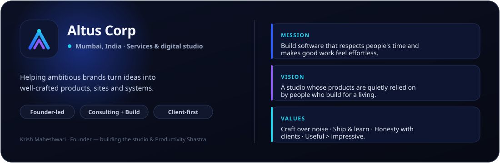

<!--
  ╔══════════════════════════════════════════════════════════════════╗
  ║  Krish Maheshwari · GitHub profile README                         ║
  ║  Founder of Altus Corp · Creator of Productivity Shastra          ║
  ║                                                                    ║
  ║  Built like a product, not a template. Hand-authored animated     ║
  ║  SVGs live in /assets — edit those, not third-party widgets.      ║
  ║  Customisation guide → docs/CUSTOMIZATION.md                      ║
  ║  Design tokens        → docs/DESIGN.md                            ║
  ╚══════════════════════════════════════════════════════════════════╝
-->

<!-- ░░░░░░░░░░░░░░░░░░░░░░░░  HERO  ░░░░░░░░░░░░░░░░░░░░░░░░ -->
<div align="center">

  

  <br/><br/>

  <!-- dynamic typed subtitle (replaceable third-party widget — see docs/CUSTOMIZATION.md) -->
  <a href="https://github.com/KrishMaheshwari-pro">
    
  </a>

  <br/>

  <!-- ── primary links ─────────────────────────────────────── -->
  <a href="https://github.com/KrishMaheshwari-pro">
    </a>
  <a href="https://www.linkedin.com/in/krish--maheshwari/">
    </a>
  <a href="https://instagram.com/krishmaheshwari07">
    </a>
  <a href="https://krishmaheshwari.vercel.app">
    </a>
  <a href="mailto:krishmaheshwari111@gmail.com">
    </a>

  <br/><br/>

  <!-- ── section nav (links resolve to GitHub's auto heading anchors) ── -->
  <kbd><a href="#about">About</a></kbd> &nbsp;
  <kbd><a href="#altus-corp">Altus Corp</a></kbd> &nbsp;
  <kbd><a href="#productivity-shastra">Productivity Shastra</a></kbd> &nbsp;
  <kbd><a href="#tech-stack">Stack</a></kbd> &nbsp;
  <kbd><a href="#featured-projects">Projects</a></kbd> &nbsp;
  <kbd><a href="#github-stats">Stats</a></kbd> &nbsp;
  <kbd><a href="#connect">Connect</a></kbd>

  <br/>

  

</div>

<br/>

<!-- ░░░░░░░░░░░░░░░░░░░░░░░░  ABOUT  ░░░░░░░░░░░░░░░░░░░░░░░░ -->
## About

> **I build software that respects people's time.**
> Engineering student by day, founder by obsession — turning rough ideas into
> products that feel calm, fast and genuinely useful.

I'm **Krish Maheshwari** — founder of **Altus Corp**, a Mumbai-based services & digital studio,
and the creator of **Productivity Shastra**, an all-in-one productivity platform I designed and
shipped during my internship. I work across the full stack, lean hard into AI, and care a little
too much about the details most people scroll past.

<table>
<tr>
<td width="50%" valign="top">

**What I'm doing now**
- 🏗️ Building **Productivity Shastra** — AI-assisted planning & focus
- 🚀 Running **Altus Corp** — client work + product
- 🎓 Studying engineering, shipping on the side
- 🧠 Going deep on AI systems & developer-grade UX

</td>
<td width="50%" valign="top">

**How I think about building**
- Useful **>** impressive
- Ship, measure, learn — then refine
- Performance and polish are features
- Build in public, stay honest about progress

</td>
</tr>
</table>

<div align="center"></div>

<!-- ░░░░░░░░░░░░░░░░░░░░░░░░  ALTUS CORP  ░░░░░░░░░░░░░░░░░░░░░░░░ -->
## Altus Corp

<div align="center">
  
</div>

**Altus** *(Latin: high, elevated)* is the studio I'm building — based in **Mumbai, India**.
It exists to help ambitious people and brands turn ideas into well-crafted products, websites and
systems. Not a SaaS factory — a craft-first studio where consulting and building live side by side,
with **Productivity Shastra** as its flagship product.

```text
Founded   ·  Mumbai, India
Focus     ·  Digital products · Consulting · Web & systems engineering
Operating ·  Client-first · Founder-led · Quality over volume
Flagship  ·  Productivity Shastra
```

<div align="center"></div>

<!-- ░░░░░░░░░░░░░░░░░░░░  PRODUCTIVITY SHASTRA  ░░░░░░░░░░░░░░░░░░░░ -->
## Productivity Shastra

<table>
<tr>
<td width="120" valign="top" align="center">
  
</td>
<td valign="middle">

### The flagship — a productivity platform, not just an app.

*"Shastra"* means a **discipline** — a body of knowledge you can practise. Productivity Shastra
turns that idea into software: a single, calm place to **plan, focus, and ship** — now growing an
**AI layer** that does the heavy lifting of organising your day.

</td>
</tr>
</table>

#### Modules

<table>
<tr>
<td width="33%" valign="top">

**🗂️ Plan**
Tasks, projects and goals in one structured workspace — built to reduce noise, not add it.

</td>
<td width="33%" valign="top">

**🎯 Focus**
Time-blocking, sessions and gentle nudges that protect deep work instead of interrupting it.

</td>
<td width="33%" valign="top">

**✨ Assist (AI)**
Smart planning, auto-scheduling and summaries — your plan, organised for you.

</td>
</tr>
<tr>
<td valign="top">

**📊 Reflect**
Lightweight reviews and insights so progress is visible, not guessed.

</td>
<td valign="top">

**🔁 Sync**
Realtime sync across devices with an offline-first, installable PWA.

</td>
<td valign="top">

**🧩 Extend**
A modular core meant to grow — new modules without rewrites.

</td>
</tr>
</table>

#### Architecture

<div align="center">
  
</div>

#### Roadmap

<div align="center">
  
</div>

<div align="center">

`React` · `Next.js` · `TypeScript` · `Node.js` · `Python · FastAPI` · `Supabase` · `PostgreSQL` · `Tailwind CSS` · `LangChain`

</div>

<div align="center"></div>

<!-- ░░░░░░░░░░░░░░░░░░░░░░░░  TECH STACK  ░░░░░░░░░░░░░░░░░░░░░░░░ -->
## Tech Stack

<div align="center">
  
</div>

<div align="center"></div>

<!-- ░░░░░░░░░░░░░░░░░░░░░░░░  PROJECTS  ░░░░░░░░░░░░░░░░░░░░░░░░ -->
## Featured Projects

<table>
<tr>
<td width="50%" valign="top">

### ✦ Productivity Shastra
All-in-one productivity platform — plan, focus, reflect, with a growing AI layer.

`Next.js` `Supabase` `Python` `LangChain`

**Status** — In active development
[**→ Repositories**](https://github.com/KrishMaheshwari-pro?tab=repositories)

</td>
<td width="50%" valign="top">

### ✦ Altus Corp — Web
Studio site & client delivery — marketing, case work, and product surfaces.

`React` `Next.js` `Tailwind` `Vercel`

**Status** — Building
[**→ Repositories**](https://github.com/KrishMaheshwari-pro?tab=repositories)

</td>
</tr>
<tr>
<td valign="top">

### ✦ AI Experiments
A sandbox for agents, RAG and developer tooling — where ideas get prototyped.

`Python` `OpenAI` `Vector DBs`

**Status** — Ongoing
[**→ Repositories**](https://github.com/KrishMaheshwari-pro?tab=repositories)

</td>
<td valign="top">

### ✦ This Profile
A profile built like a product — hand-authored animated SVGs, automated stats.

`SVG` `GitHub Actions` `Design`

**Status** — You're looking at it
[**→ Source**](https://github.com/KrishMaheshwari-pro/KrishMaheshwari-pro)

</td>
</tr>
</table>

> 🛈 Project cards are curated. Pin your best repos (**Profile → Customize your pins**) and they'll show below your stats automatically.

<div align="center"></div>

<!-- ░░░░░░░░░░░░░░░░░░░░░░░░  GITHUB STATS  ░░░░░░░░░░░░░░░░░░░░░░░░ -->
## GitHub Stats

<div align="center">

  
  

  <br/>

  

  <br/><br/>

  

  <br/>

  

</div>

<!--
  SNAKE & METRICS images below are GENERATED by GitHub Actions.
  They appear blank until you run the workflows once (Actions tab → run each).
  See docs/WORKFLOWS.md.
-->
#### Contribution Snake
<div align="center">
  <picture>
    <source media="(prefers-color-scheme: dark)" srcset="https://raw.githubusercontent.com/KrishMaheshwari-pro/KrishMaheshwari-pro/output/github-snake-dark.svg?v=2" />
    <source media="(prefers-color-scheme: light)" srcset="https://raw.githubusercontent.com/KrishMaheshwari-pro/KrishMaheshwari-pro/output/github-snake.svg?v=2" />
    
  </picture>
</div>

<details>
<summary><b>📈 Detailed metrics</b> (generated by the metrics workflow)</summary>
<br/>
<div align="center">
  
</div>
</details>

#### Recent Activity
<!--START_SECTION:activity-->
<!-- The recent-activity workflow auto-fills this list. Until it runs, this placeholder stays. -->
1. 🛠️ Building Productivity Shastra
2. 🎨 Refining this profile
3. 🚀 Shipping for Altus Corp
<!--END_SECTION:activity-->

<div align="center"></div>

<!-- ░░░░░░░░░░░░░░░░░░░░░░░░  PHILOSOPHY  ░░░░░░░░░░░░░░░░░░░░░░░░ -->
## Principles & Philosophy

<table>
<tr>
<td width="50%" valign="top">

**Design philosophy**
- Clarity first — if it needs a manual, redesign it
- Motion with meaning, never decoration for its own sake
- Whitespace is a feature, not wasted space
- Dark-first, accessible always

</td>
<td width="50%" valign="top">

**Engineering philosophy**
- Type-safe by default, tested where it counts
- Boring tech for the core, sharp tech at the edges
- Optimise the hot path, ignore the rest
- Readable code is a kindness to future-me

</td>
</tr>
<tr>
<td valign="top">

**Productivity principles**
- One system beats ten apps
- Plan less, decide once, execute calmly
- Energy is the budget; time is just the unit
- Reflection turns activity into progress

</td>
<td valign="top">

**Currently learning**
- Agentic AI & retrieval systems
- Distributed systems & scale
- Product design under real constraints
- Running a studio without losing the craft

</td>
</tr>
</table>

<div align="center">

> *"Build useful things. Build them well. Build them in public."*

</div>

<div align="center"></div>

<!-- ░░░░░░░░░░░░░░░░░░░░░░░░  CONNECT  ░░░░░░░░░░░░░░░░░░░░░░░░ -->
## Connect

<div align="center">

Always up for a good conversation about products, AI, or building things people actually use.

<a href="https://www.linkedin.com/in/krish--maheshwari/">
  </a>
<a href="https://instagram.com/krishmaheshwari07">
  </a>
<a href="mailto:krishmaheshwari111@gmail.com">
  </a>
<a href="https://krishmaheshwari.vercel.app">
  </a>

<br/>

<sub>Elsewhere (coming soon) —
  <a href="https://github.com/KrishMaheshwari-pro">X</a> ·
  <a href="https://github.com/KrishMaheshwari-pro">YouTube</a> ·
  <a href="https://github.com/KrishMaheshwari-pro">Medium</a>
</sub>

</div>

<br/>

<div align="center">
  
</div>

<div align="center">
  <sub>Designed & built by Krish Maheshwari · hand-authored SVGs, automated with GitHub Actions · <a href="https://github.com/KrishMaheshwari-pro/KrishMaheshwari-pro">source</a></sub>
</div>
